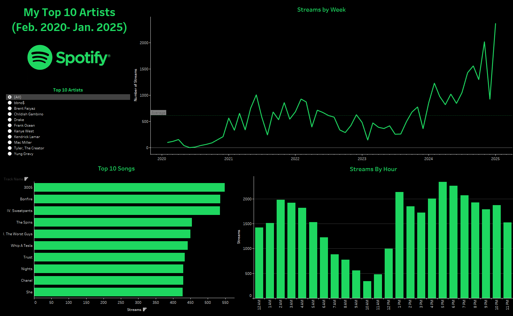

# Spotify Data Analysis and Visualization

This project used a collection of my personal Spotify data dating from February 2021 to January 2025 to collect insight into artist and listening trends. The analysis was performed using Jupyter Notebook for data cleaning and manipulation, while Tableau was used for interactive dashboards and visual storytelling.

## How It's Made:

**Tech used:** 
* Python
  - Jupyter Notebook 
  - Pandas
  - Numpy
* Tableau

This data was sourced from Spotify as a JSON file and converted into a CSV file to facilitate easier manipulation and analysis within Python. Using Pandas and Numpy, the data was cleaned by removing missing values, correcting data types, and determining qualifying streams. This cleaned data frame wsa used to analyze listening habits, including Top Artist, Top Songs, time related habits, and total listening times. Key insights were visualized using Tableau where an interactive dashboard was created to show streaming rates for my top 10 artists. These visualizations were important in highlighting and improving accessability, presentation and enabling clear insights into listening behaviors and preferences.

## Dataset:
The dataset includes information about Spotify tracks such as:
* Time Stamp
* Platform
* Milliseconds Played
* Country Streamed
* IP Address
* Track Name
* Artist Name
* Album Name
* Album Name
* Spotify Track URI
* Reason Start
* Reason end

## Lessons Learned:

* Gained proficiency and knowledge in data cleaning techniques using Pandas and Numpy.
* Improved skills in data visualization using Tableau.
* Developed strategies for collecting and produsing a product using a specialized data set.
* Gained knowlege in creating storytelling and presentation through a tablea dashboard.
